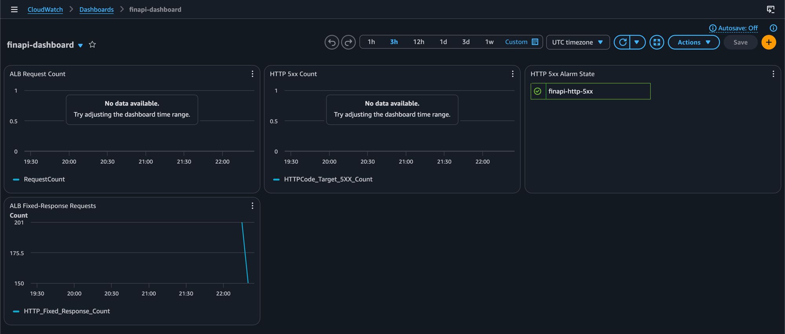

# oyd-exercise-9-2 — Dashboards (FinAPI)

Extiende el módulo de **observability** de FinAPI (estado final del Exercise 9.1)
añadiendo un único **CloudWatch dashboard** para el equipo de on-call: request
volume, error rate y el estado de la alarma de 5xx en una sola vista, sin tener
que navegar entre varias páginas de CloudWatch.

Se mantienen **todos** los recursos preexistentes del módulo (log group, SNS
topics, alarmas de HTTP 5xx / latency / EstimatedCharges y el budget guard) y se
añade el dashboard, su output y un ALB como fuente de tráfico.

## Estructura del repositorio

```
oyd-exercise-9-2/
├── versions.tf            # required_providers + providers aws (default + us-east-1)
├── main.tf                # llama al módulo observability (Task 5)
├── alb.tf                 # ALB (fuente de tráfico para el dashboard)
├── variables.tf           # variables de entrada del root
├── outputs.tf             # outputs (incluye dashboard_url y alb_dns_name)
├── envs/
│   └── dev/
│       └── dev.tfvars     # valores del entorno dev
├── evidence/
│   └── dashboard.png      # captura requerida del dashboard con datos
└── modules/
    └── observability/
        ├── main.tf        # log group, SNS, 3 alarmas, budget + dashboard (Task 1 & 2)
        ├── variables.tf
        └── outputs.tf     # outputs + dashboard_url (Task 3)
```

## ALB como fuente de tráfico

El Exercise 9.2 (Task 4) requiere **generar tráfico real** para que al menos un
widget del dashboard muestre datos (*"at least one widget shows data"*). Para
ello, en `alb.tf` se despliega un **ALB internet-facing** sobre la default VPC
con un listener `fixed-response` (HTTP 200). Su `arn_suffix` se inyecta al módulo
`observability` (`main.tf`), de modo que **todas las alarmas y todos los widgets
referencian el load balancer real**.

> **Nota sobre `RequestCount`:** un listener `fixed-response` publica el volumen
> de peticiones como **`HTTP_Fixed_Response_Count`** en lugar de `RequestCount`
> (esta última solo se incrementa cuando hay un target group). Por eso, además de
> los 3 widgets requeridos, el dashboard incluye un **Widget 4** con
> `HTTP_Fixed_Response_Count`, que es el que refleja el tráfico generado en la
> evidencia.

> `alb_arn_suffix` se obtiene de `aws_lb.finapi.arn_suffix`, así que **no se
> define** en `dev.tfvars`.

## Prerequisitos

- **AWS CLI** configurado (`aws sts get-caller-identity` devuelve el account ID).
- **Terraform >= 1.6**.
- `curl` disponible para generar tráfico de prueba.
- Un email accesible para confirmar la subscription de SNS.

## Tasks implementadas

| Task | Descripción | Dónde |
|------|-------------|-------|
| Task 1 | Recurso `aws_cloudwatch_dashboard.main` con `dashboard_body = jsonencode({...})` (sin heredoc). | `modules/observability/main.tf` |
| Task 2 | Cuatro widgets: **(1)** ALB `RequestCount`, **(2)** `HTTPCode_Target_5XX_Count`, **(3)** alarm widget del alarm `http_5xx`, **(4)** `HTTP_Fixed_Response_Count` (tráfico real). Todos referencian Terraform expressions (sin ARNs/IDs hardcodeados). | `modules/observability/main.tf` |
| Task 3 | Output `dashboard_url` en el módulo y expuesto en el root. | `modules/observability/outputs.tf`, `outputs.tf` |
| Task 4 | `terraform apply` + generación de tráfico contra el ALB y captura de evidencia. | ver abajo |

### Detalle de los widgets (Task 2)

1. **ALB Request Count** — `type = "metric"`, namespace `AWS/ApplicationELB`,
   metric `RequestCount`, dimensión `LoadBalancer = var.alb_arn_suffix`,
   `stat = "Sum"`, `period = 300`.
2. **HTTP 5xx Count** — mismo namespace/dimensión, metric
   `HTTPCode_Target_5XX_Count`, `stat = "Sum"`, `period = 300`.
3. **HTTP 5xx Alarm State** — `type = "alarm"`, referencia
   `aws_cloudwatch_metric_alarm.http_5xx.arn` (resource attribute).
4. **ALB Fixed-Response Requests** — `type = "metric"`, metric
   `HTTP_Fixed_Response_Count`, misma dimensión, `stat = "Sum"`, `period = 300`.
   Es el widget que muestra datos reales (ver matiz arriba).

## Despliegue

```bash
terraform init
terraform apply -var-file="envs/dev/dev.tfvars"
```

Tras el apply, **revisa tu email y confirma la subscription de SNS** (dos correos:
uno del topic en `us-east-2` y otro del topic en `us-east-1` para la alarma de
billing).

## Generar tráfico y abrir el dashboard (Task 4)

```bash
# DNS del ALB
terraform output alb_dns_name

# Generar 200 requests contra el ALB
ALB=$(terraform output -raw alb_dns_name)
for i in $(seq 1 200); do curl -4 -s -o /dev/null "http://$ALB/"; done

# Esperar 2-3 minutos a que CloudWatch ingiera las métricas y abrir el dashboard
terraform output dashboard_url
```

El widget **ALB Fixed-Response Requests** muestra el pico de tráfico generado
(ver el matiz sobre `RequestCount` más arriba). La captura del dashboard cargado
y con datos está en `evidence/dashboard.png`.

## Evidencia

### CloudWatch dashboard `finapi-dashboard` con datos



## Limpieza (destroy)

```bash
terraform destroy -var-file="envs/dev/dev.tfvars"
```

Destruye **todos** los recursos creados, incluido el ALB.
